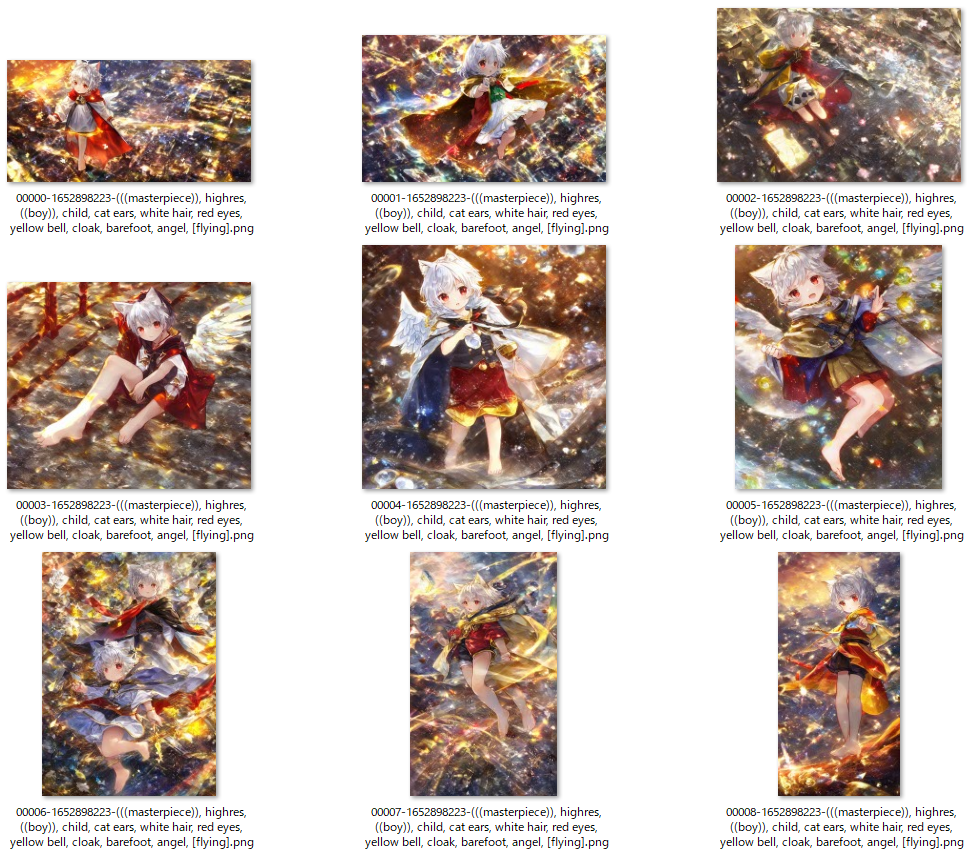
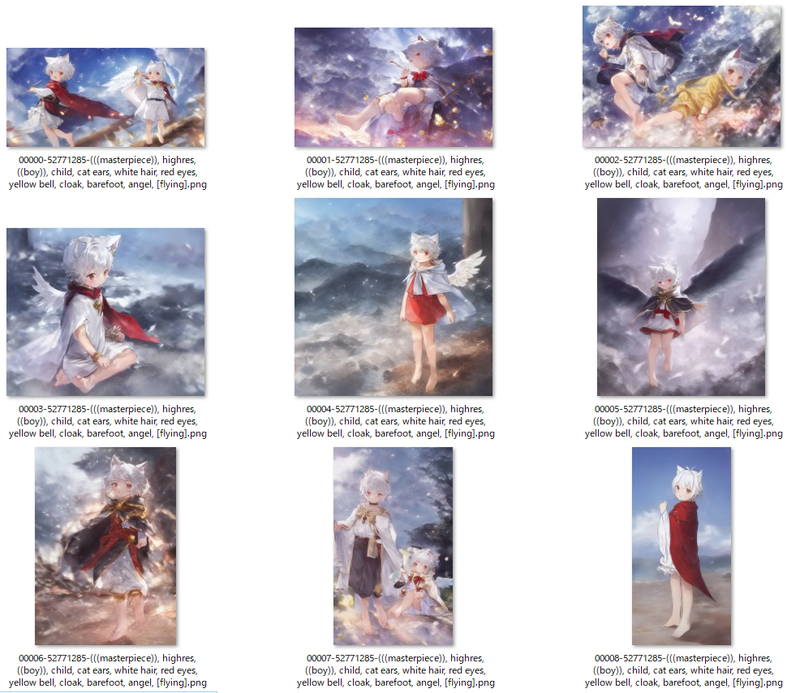
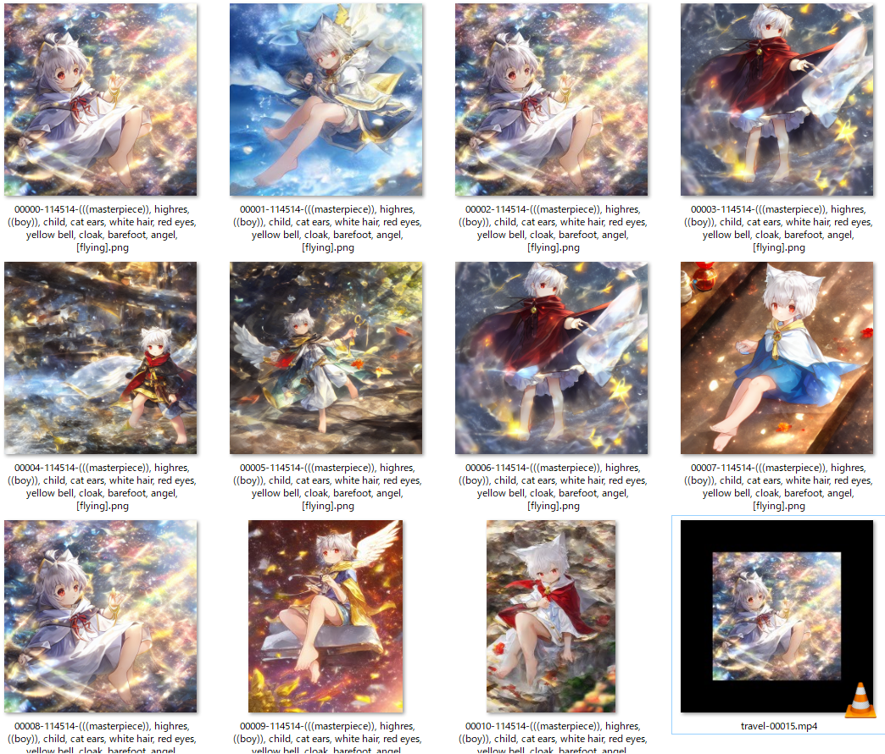
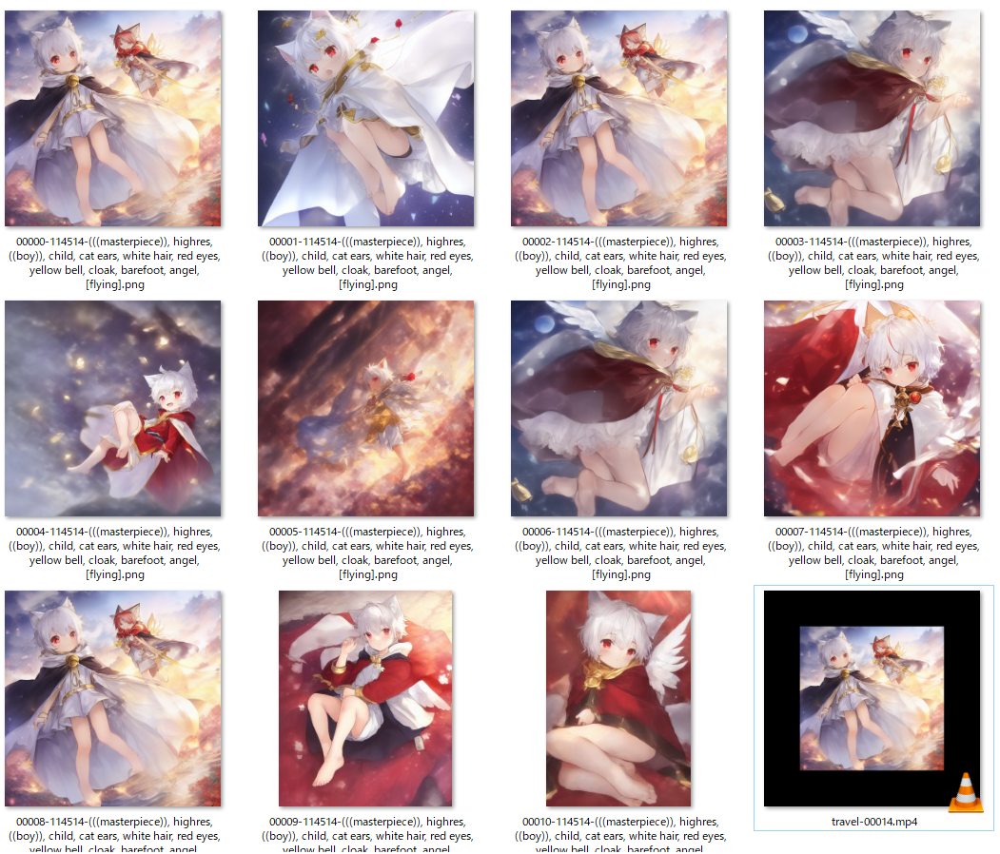
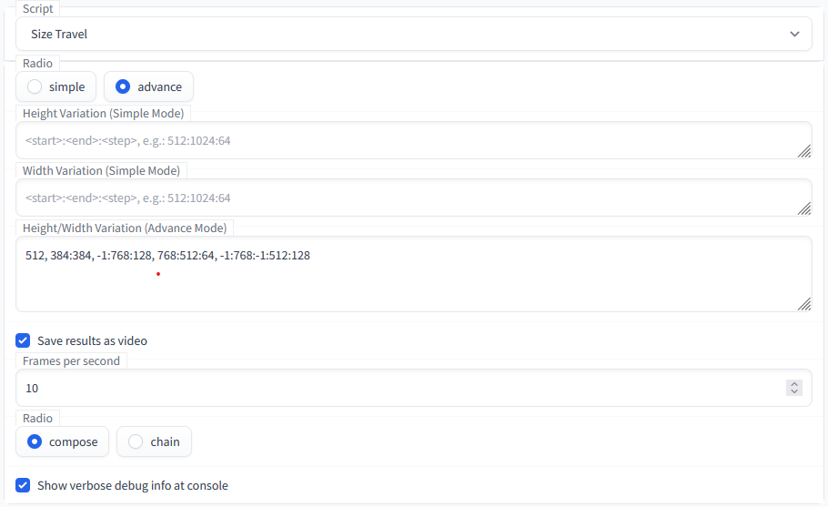

# stable-diffusion-webui-size-travel

    Experimental script for AUTOMATIC1111/stable-diffusion-webui to create images that changes in size.

----

Inspired by yownas's seed-travel: [https://github.com/yownas/seed_travel](https://github.com/yownas/seed_travel), great thanks for the base code! 😀

The native **X/Y plot** script is powerful enough, but lacks the variation dimension of **image size**.  
Let's just implement this. 🙂  

### How it works?

- generate image one by one (`batch count/size` are ignored)
- varying width and height according to your options
  - freeze all other settings (`steps`, `sampler`, `cfg factor`, `seed`, etc.)
  - note that only the major `seed` will be forcely fixed through all processes, you can still set `subseed = -1` to allow more variances
- export a video!

ℹ 笑死，根本travel不起来…… 因为size的变更单位是64，跨度还是过于大了 :(

⚪ simple mode

```
height = 512:1024
width  = 1024:512
=> [(512, 1024), (576, 960), (640, 896), (704, 832), (768, 768), (832, 704), (896, 640), (960, 576), (1024, 512)]
```

**DDIM**: 


**Eular a**: 


⚪ advance mode

```
512, 384:384, -1:768:128, 768:512:64, -1:768:-1:512:128
=> [(512, 512), (384, 384), (512, 512), (640, 640), (768, 768), (704, 704), (640, 640), (576, 576), (512, 512), (640, 512), (768, 512)]
```

**DDIM**: 


**Eular a**: 



### Options



#### simple mode

One line quick setting how height/width varies.

- height: (string, format: `<start>:<end>:<step>`)
- width: (string, format: `<start>:<end>:<step>`)
  - ascending:  `512:768:64` => `[512, 576, 640, 704, 768]`
  - descending: `768:512:64` => `[768, 704, 640, 576, 512]`
  - omit step:  `512:768`    (same as the first, due to global default `DEFAULT_STEP=64`)
  - const:      `512`        => `[512, ...]`, length is broadcasted to the other dimension 
  - (*) the `step` must be postive, no worry: the ascending/descending order is auto inferred from `start` and `end`:)
- video
  - fps: (float), FPS of video, set `0` to disable file saving
  - concat: (categorical), method to concat different sized pictures

ℹ the computed n_steps for height and width should be the same, if not, it will auto broadcast to the **longer** one by constly padding by the last value
⚠ simple mode does **NOT** support syntax of chaining `,` and auto size infer `-1` like in advanced mode

#### advanced mode

Detailed setting each (height, width) pair for each travel step.

- height/width: (string, formats see below)
  - 1-seg: `<hw>`,    e.g.: `512`     => `[(512, 512)]`
  - 2-seg: `<h>:<w>`, e.g.: `512:768` => `[(512, 768)]`
  - 3-seg: `<hw_start>:<hw_end>:<step>`, e.g.: `512:768:128` => `[(512, 512), (640, 640), (768, 768)]`
  - 4-seg: `<h_start>:<h_end>:<w_start>:<w_end>`, same as 5-seg using `DEFAULT_STEP`
  - 5-seg: `<h_start>:<h_end>:<w_start>:<w_end>:<step>`, unified step size for height/width
  - 6-seg: `<h_start>:<h_end>:<h_step>:<w_start>:<w_end>:<w_step>`, separate step size for height/width
  - (*) you can chain them up with `,`, and use `-1` referring to `current height/weight`
    - e.g.: `512, 384:384, -1:768:128, 768:512:114514, -1:768:-1:512:128` => `[(512, 512), (384, 384), (512, 512), (640, 640), (768, 768), (768, 640), (768, 512)]`
    - e.g.: `512:768:768:512:128` => `[(512, 768), (640, 640), (768, 512)]`
    - NOTE: successive identical shapes would be automatically collapsed to one (`[(512, 512), (512, 512)]` will urn to be `[(512, 512)]`)


### Installation

Easiest way to install it is to:
1. Go to the "Extensions" tab in the webui
2. Click on the "Install from URL" tab
3. Paste https://github.com/Kahsolt/stable-diffusion-webui-size-travel.git into "URL for extension's git repository" and click install
4. (Optional) You will need to restart the webui for dependensies to be installed or you won't be able to generate video files.

Manual install:
1. Copy the file in the scripts-folder to the scripts-folder from https://github.com/AUTOMATIC1111/stable-diffusion-webui
2. Add `moviepy==1.0.3` to requirements_versions.txt


#### trouble shoot

Q: I got error message like `error gen size (h, w)`
A: Depending on your sampler, some certain sizes are not supported and causes mis-alignment in model upsample/downsampling steps, the traveler will ignore them.

----

by Armit
2022/11/09 
